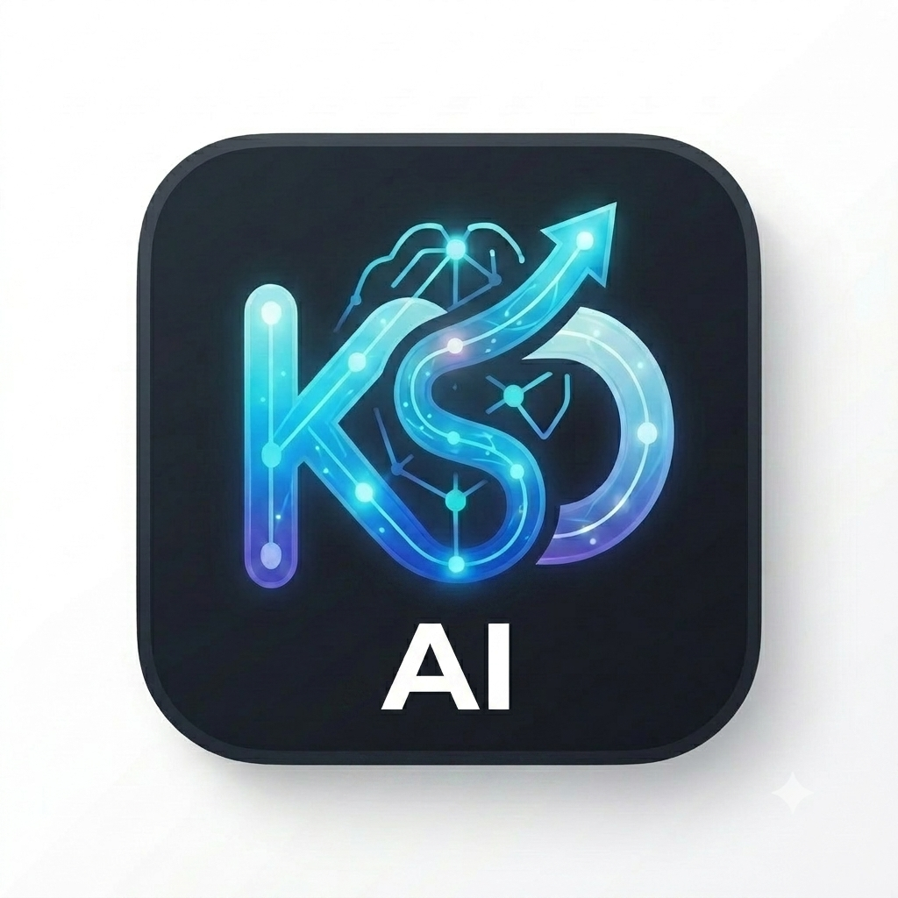

# Chaubey Ji — AI Coding Assistant for VS Code

**Version 2.0.0** — A professional VS Code extension that provides AI-powered code analysis, chat, debugging, documentation, and testing with **6 AI providers**.



## ✨ What's New in V2.0

🎉 **Multi-Provider Architecture** — Choose from 6 AI providers:
- **Groq** — Fast, free AI inference (NEW production models)
- **Google Gemini** — Advanced reasoning and vision
- **OpenAI** — GPT-4, GPT-4o, and o-series reasoning models
- **DeepSeek** — Advanced reasoning with 1M context (NEW in V2)
- **Together AI** — 100+ open-source models
- **Localhost** — Local LM Studio, Ollama, or llama.cpp

🔒 **Independent API Keys** — Each provider maintains its own secure API key  
🔄 **Dynamic Model Selection** — Switch providers and models on the fly  
✅ **All 14 Commands Working** — Complete AI assistant functionality  
🚀 **Production Ready** — Verified with current 2026 models

---

## 📋 Features

### 🤖 14 AI-Powered Commands

**Code Analysis & Understanding:**
- 🔍 **Analyze Code** — Deep analysis of code structure, complexity, and patterns
- 📖 **Explain Code** — Clear explanations of how code works
- 💬 **Let's Talk About This** — Interactive discussion about code

**Code Improvement:**
- 🐛 **Debug & Fix** — Identify and fix bugs automatically
- ⚡ **Improve Code** — Optimize performance and readability
- 🔄 **Convert Code** — Transform code between languages/frameworks

**Documentation & Testing:**
- 📝 **Generate Documentation** — Auto-generate comprehensive docs
- 🧪 **Generate Tests** — Create unit tests for your code
- 📊 **Summarize** — Quick summaries of code or text

**Text & Content:**
- ✍️ **Grammar Fixer** — Fix grammar and improve writing
- ✅ **Fact Check** — Verify claims and statements
- 🔗 **Create Follow-up** — Generate contextual follow-up questions

**Chat & Discussion:**
- 💬 **Chat Discussion** — Free-form AI conversation

### 🎯 Provider Selection

Choose the best AI provider for your needs:

| Provider | Type | Best For | Context | Cost |
|----------|------|----------|---------|------|
| **Groq** | Cloud | Speed, coding | 128K | Free |
| **Gemini** | Cloud | Reasoning, vision | 1M | Free |
| **OpenAI** | Cloud | GPT-4, o-series | 128K | Paid |
| **DeepSeek** | Cloud | Reasoning, coding | 1M | Paid |
| **Together** | Cloud | Open-source models | Varies | Paid |
| **Localhost** | Local | Privacy, offline | Varies | Free |

---

## 🚀 Quick Start

### Installation

1. **Install from VSIX:**
   ```powershell
   code --install-extension chaubey-ji-2.0.0.vsix
   ```

2. **Or install from VS Code:**
   - Open VS Code
   - Go to Extensions (Ctrl+Shift+X)
   - Search for "Chaubey Ji"
   - Click Install

### First-Time Setup

1. **Open Settings:**
   - Command Palette (Ctrl+Shift+P)
   - Type: `AI Assistant: Open AI Assistant Settings`

2. **Choose Provider:**
   - Select from dropdown (Groq, Gemini, OpenAI, etc.)

3. **Get API Key:**
   - Follow provider-specific instructions in Settings UI
   - Each provider has step-by-step guide

4. **Enter API Key:**
   - Paste your API key
   - Click **Save Settings**

5. **Test Connection:**
   - Click **Test Connection**
   - Verify: ✅ Connection successful!

6. **Start Using:**
   - Select code in editor
   - Right-click → AI Assistant → Choose action

---

## 🔧 Configuration

### Provider Setup Guides

<details>
<summary><b>Groq (Recommended: Fast & Free)</b></summary>

**Models:** `openai/gpt-oss-20b` (fastest), `openai/gpt-oss-120b` (smartest)

1. Go to [console.groq.com](https://console.groq.com)
2. Sign up for free account
3. Click "API Keys" in sidebar
4. Create API key (starts with `gsk_`)
5. Paste in Chaubey Ji Settings

**Updated August 2026:** Groq deprecated llama-3.x models on June 17, 2026. Now using production `openai/gpt-oss` models.

</details>

<details>
<summary><b>Google Gemini (Free, Advanced Reasoning)</b></summary>

**Models:** `gemini-2.5-flash` (recommended), `gemini-2.5-pro`, `gemini-1.5-flash`

1. Go to [makersuite.google.com/app/apikey](https://makersuite.google.com/app/apikey)
2. Sign in with Google account
3. Click "Create API Key"
4. Copy key (starts with `AIza`)
5. Paste in Chaubey Ji Settings

</details>

<details>
<summary><b>OpenAI (GPT-4, o-series)</b></summary>

**Models:** `gpt-4o-mini` (recommended), `gpt-4o`, `gpt-4.1`, `o4-mini`, `o3-mini`

1. Go to [platform.openai.com/api-keys](https://platform.openai.com/api-keys)
2. Sign in to OpenAI account
3. Click "Create new secret key"
4. Copy key (starts with `sk-`)
5. Paste in Chaubey Ji Settings

**Note:** Requires paid OpenAI account with credits.

</details>

<details>
<summary><b>DeepSeek (1M Context, Reasoning)</b></summary>

**Models:** `deepseek-v4-flash` (fast), `deepseek-v4-pro` (most capable)

1. Go to [platform.deepseek.com](https://platform.deepseek.com)
2. Sign up or sign in
3. Navigate to API Keys
4. Create new API key
5. Paste in Chaubey Ji Settings

**V4 Features:** 1M context window, thinking mode, 384K max output

</details>

<details>
<summary><b>Together AI (100+ Models)</b></summary>

**Models:** `moonshotai/Kimi-K2.6`, `MiniMaxAI/MiniMax-M3`, `meta-llama/Llama-3.3-70B-Instruct-Turbo`

1. Go to [api.together.xyz](https://api.together.xyz)
2. Create account and sign in
3. Go to Settings → API Keys
4. Create new API key
5. Paste in Chaubey Ji Settings

</details>

<details>
<summary><b>Localhost (LM Studio, Ollama)</b></summary>

**Requirements:** LM Studio or Ollama running locally

1. Install [LM Studio](https://lmstudio.ai) or Ollama
2. Start local server (default: localhost:1234)
3. Verify server is running
4. API key is optional
5. Save settings and start using

</details>

---

## 💡 Usage Examples

### Example 1: Analyze Code

```javascript
// Select this function
function calculateDiscount(price, discountPercent) {
    return price - (price * discountPercent / 100);
}
```

1. Select the function
2. Right-click → AI Assistant → **Analyze Code**
3. View analysis in sidebar:
   - Function purpose
   - Parameter validation needed
   - Edge cases to handle
   - Performance considerations

### Example 2: Generate Tests

```python
# Select this function
def factorial(n):
    if n == 0:
        return 1
    return n * factorial(n - 1)
```

1. Select the function
2. Right-click → AI Assistant → **Generate Tests**
3. Get comprehensive test suite:
   - Test for n=0, n=1, n=5
   - Edge cases
   - Error handling
   - pytest or unittest format

### Example 3: Debug & Fix

```javascript
// This has a bug!
const users = [/* array */];
const user = users.find(u => u.id = targetId); // Bug: = instead of ===
```

1. Select the buggy code
2. Right-click → AI Assistant → **Debug & Fix**
3. AI identifies: Assignment operator instead of comparison
4. Provides corrected code with explanation

---

## 🏗️ Architecture

### Multi-Provider Design

```
┌─────────────────────────────────────────────┐
│           User Selects Provider             │
│      (Groq/Gemini/OpenAI/DeepSeek/etc)     │
└─────────────────────────────────────────────┘
                     ↓
┌─────────────────────────────────────────────┐
│            AIService (Router)               │
│   • No hardcoding                           │
│   • Uses settings.provider                  │
│   • Provider-aware errors                   │
└─────────────────────────────────────────────┘
                     ↓
        ┌────────────┴────────────┐
        ↓                         ↓
┌─────────────┐           ┌─────────────┐
│  Provider   │           │  Provider   │
│  Instance   │    ...    │  Instance   │
│  (Groq)     │           │  (Gemini)   │
└─────────────┘           └─────────────┘
        ↓                         ↓
┌─────────────┐           ┌─────────────┐
│  API Key    │           │  API Key    │
│  (per prov) │           │  (per prov) │
└─────────────┘           └─────────────┘
```

### Key Components

**Providers:** Each provider implements `AIProvider` interface
- `generate()` — Send request, get response
- `testConnection()` — Verify API key works
- `validateApiKey()` — Format validation
- `availableModels` — Provider-specific models

**Services:**
- `AIService` — Routes requests to selected provider
- `SettingsService` — Manages config + API keys (SecretStorage)
- `SelectionService` — Handles editor selections
- `PromptService` — Generates prompts for each command

**UI:**
- `SettingsViewProvider` — Provider dropdown, model selection, API key management
- `SidebarProvider` — Displays AI responses with copy/insert actions

---

## 🔒 Security

✅ **API Keys Encrypted** — Stored in VS Code SecretStorage  
✅ **Per-Provider Keys** — Each provider has independent key  
✅ **Never Logged** — Keys never appear in logs or error messages  
✅ **Webview CSP** — Content Security Policy with nonces  
✅ **No External Scripts** — All code bundled with extension  
✅ **HTTPS Only** — All API calls use secure connections

---

## 🧪 Testing

### Manual Testing Checklist

**Provider Switching:**
- [ ] Select Groq → models update to Groq models
- [ ] Select Gemini → models update to Gemini models
- [ ] Select OpenAI → models update to OpenAI models
- [ ] Select DeepSeek → models update to DeepSeek models
- [ ] Select Together → models update to Together models
- [ ] Select Localhost → models update to local models

**API Key Isolation:**
- [ ] Save Groq key → stored under `aiAssistant.apiKey.groq`
- [ ] Switch to Gemini → shows "No API key"
- [ ] Save Gemini key → stored under `aiAssistant.apiKey.gemini`
- [ ] Switch back to Groq → Groq key still present
- [ ] Each provider maintains independent key

**Connection Testing:**
- [ ] Test Groq connection → uses Groq key + model
- [ ] Test Gemini connection → uses Gemini key + model
- [ ] Test with invalid key → shows provider-specific error
- [ ] Test without key → shows "API key not configured for [Provider]"

**Code Generation:**
- [ ] All 14 commands work with each provider
- [ ] Responses appear in sidebar
- [ ] Copy to clipboard works
- [ ] Insert at cursor works

---

## 📊 Model Reference

### Current Models (August 2026)

**Groq:**
- `openai/gpt-oss-20b` — 1000 T/sec, fastest ⚡
- `openai/gpt-oss-120b` — 500 T/sec, smartest 🧠
- `qwen/qwen3.6-27b` — 500 T/sec, preview

**Gemini:**
- `gemini-2.5-flash` — Recommended default
- `gemini-2.5-pro` — Most capable
- `gemini-1.5-flash` — Legacy but stable

**OpenAI:**
- `gpt-4o-mini` — Recommended default
- `gpt-4o` — Best overall
- `gpt-4.1` — Specialized for coding
- `o4-mini` — Fast reasoning
- `o3-mini` — Cost-efficient reasoning

**DeepSeek:**
- `deepseek-v4-flash` — Fast, cost-effective
- `deepseek-v4-pro` — Most capable, 1.6T params

**Together AI:**
- `moonshotai/Kimi-K2.6` — Best chat/reasoning
- `MiniMaxAI/MiniMax-M3` — Mid-size general
- `meta-llama/Llama-3.3-70B-Instruct-Turbo` — Open-source Llama

**Localhost:**
- `local-model` — Your model name
- Any model loaded in LM Studio/Ollama

---

## 🐛 Troubleshooting

### Provider Issues

**"Provider not found" error:**
- Check that provider is spelled correctly in settings
- Verify provider is one of: groq, gemini, openai, deepseek, together, localhost

**Models not loading:**
- Switch provider and switch back
- Reload VS Code window
- Check Output panel → "AI Assistant"

**API key not working:**
- Verify key format matches provider (e.g., Groq starts with `gsk_`)
- Test with provider's official playground/console
- Check API key hasn't expired or been revoked

### Connection Issues

**Test Connection fails:**
- Verify internet connection (for cloud providers)
- Check API key is valid and has credits
- Try different model from provider
- Check provider's status page

**Localhost not connecting:**
- Verify LM Studio/Ollama is running
- Check server is listening on localhost:1234
- Try custom endpoint if using different port
- Verify model is loaded in local server

### General Issues

**Extension doesn't activate:**
- Check VS Code version >= 1.85.0
- Reload window (Ctrl+Shift+P → "Reload Window")
- Check Output panel for errors

**Commands don't appear:**
- Make sure text is selected
- Right-click on selected text
- Commands only appear when `editorHasSelection` is true

---

## 🛠️ Development

### Build Commands

```powershell
# Install dependencies
npm install

# Compile TypeScript
npm run compile

# Watch mode (auto-compile)
npm run watch

# Package extension
npx vsce package --allow-missing-repository --skip-license
```

### Project Structure

```
src/
├── commands/        # 14 AI commands
├── providers/       # 6 AI provider implementations
│   ├── AIProvider.ts
│   ├── GroqProvider.ts
│   ├── GeminiProvider.ts
│   ├── OpenAIProvider.ts
│   ├── DeepSeekProvider.ts
│   ├── TogetherProvider.ts
│   └── LocalhostProvider.ts
├── services/        # Core services
│   ├── AIService.ts
│   ├── SettingsService.ts
│   ├── SelectionService.ts
│   └── PromptService.ts
├── ui/              # Webview providers
│   ├── SettingsViewProvider.ts
│   └── SidebarProvider.ts
├── prompts/         # Prompt templates
├── utils/           # Utilities
└── extension.ts     # Entry point
```

---

## 📝 Migration from 0.1.0

If upgrading from version 0.1.0:

1. **API Keys Preserved:** Your Gemini key is automatically migrated
2. **New Providers:** You can now add Groq, OpenAI, DeepSeek, Together, Localhost
3. **Default Provider:** Changed from Gemini to Groq (faster, free)
4. **All Commands Work:** All 14 commands are now functional (vs. only Analyze Code in 0.1.0)
5. **Model Updates:** Gemini models updated, deprecated models removed

**Action Required:**
- Open Settings to see new provider dropdown
- Consider trying Groq (free, fast) or DeepSeek (1M context)
- Update model selection (some old models deprecated)

---

## 🗺️ Roadmap

### V2.0 ✅ (Current)
- ✅ Multi-provider architecture (6 providers)
- ✅ All 14 commands functional
- ✅ Dynamic model selection
- ✅ Independent API key management
- ✅ Production-ready

### V2.1 (Planned)
- 🔄 Conversation history
- 🔄 Markdown rendering in responses
- 🔄 Apply code changes directly
- 🔄 Custom prompt templates
- 🔄 Perplexity provider

### V3.0 (Future)
- 🔮 Chat interface
- 🔮 Multi-file context
- 🔮 Code diff preview
- 🔮 Agent workflows
- 🔮 MCP integration

---

## 📄 License

[Your License Here]

## 🙏 Acknowledgments

- Built with VS Code Extension API
- Powered by Groq, Gemini, OpenAI, DeepSeek, Together AI
- Icons from Google Material Design

---

## 📞 Support

- **Issues:** [GitHub Issues](https://github.com/your-repo/issues)
- **Documentation:** This README
- **Output Panel:** Check "AI Assistant" channel in VS Code Output panel

---

**Version 2.0.0** — Production Ready  
**Updated:** August 2026  
**Providers:** 6 (Groq, Gemini, OpenAI, DeepSeek, Together, Localhost)  
**Commands:** 14 (All Functional)  
**Status:** ✅ Stable

